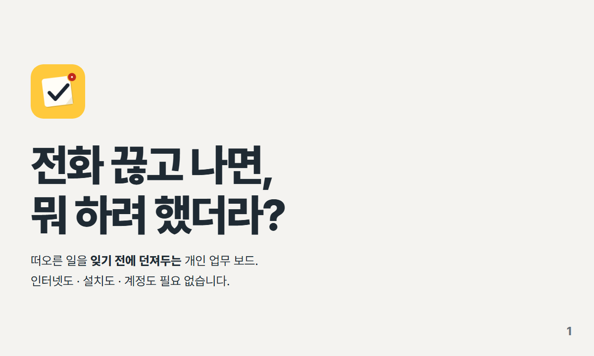
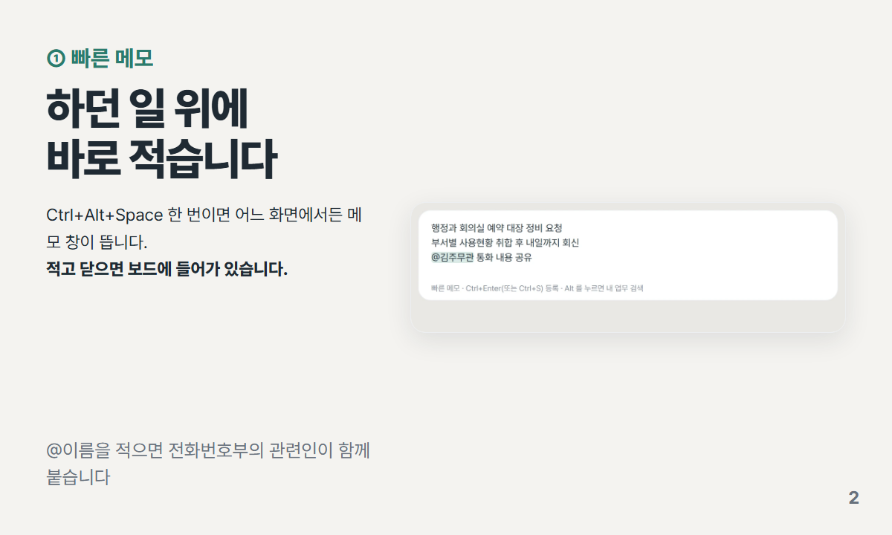
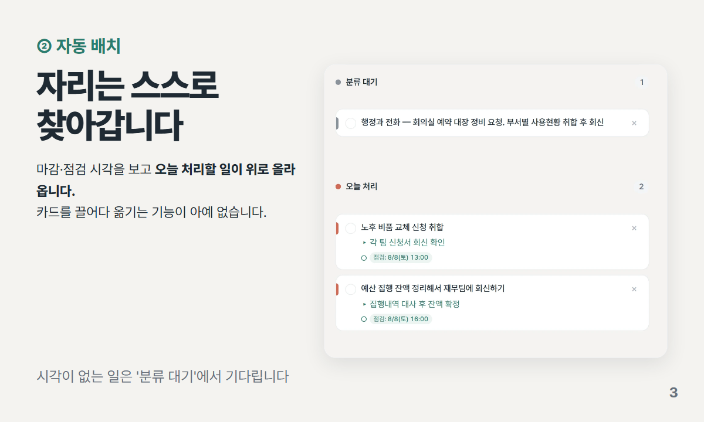
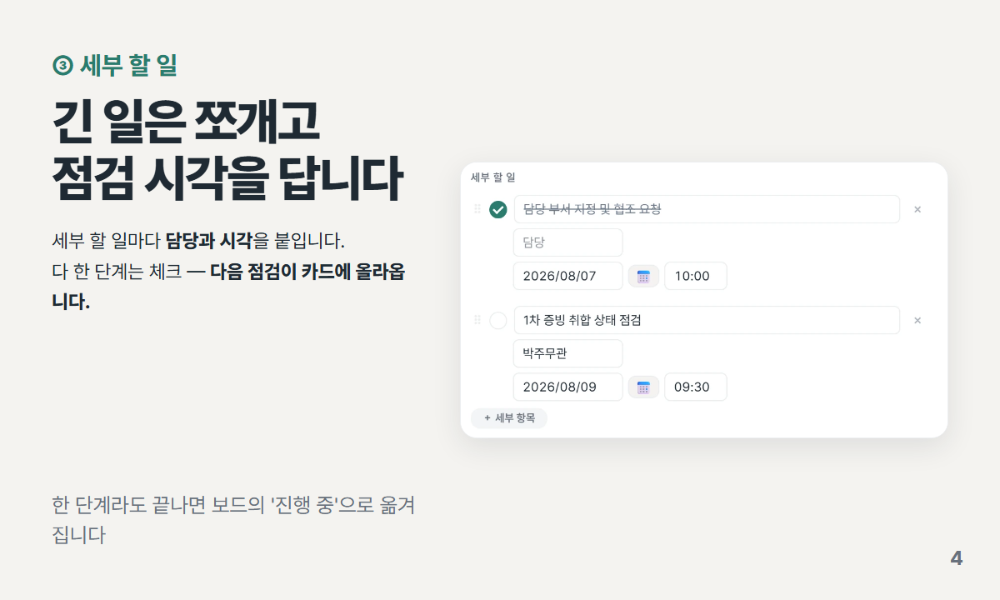
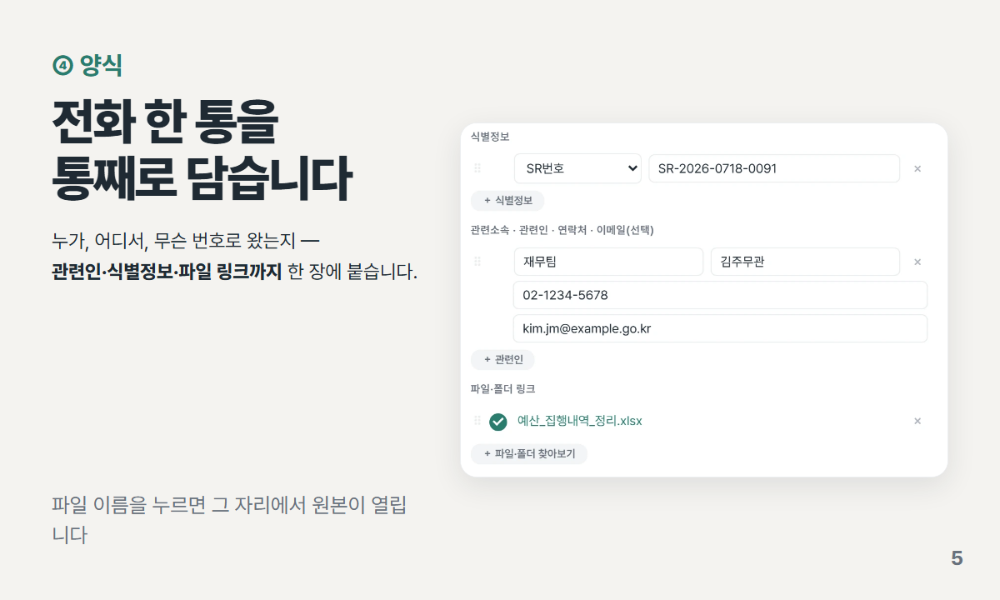
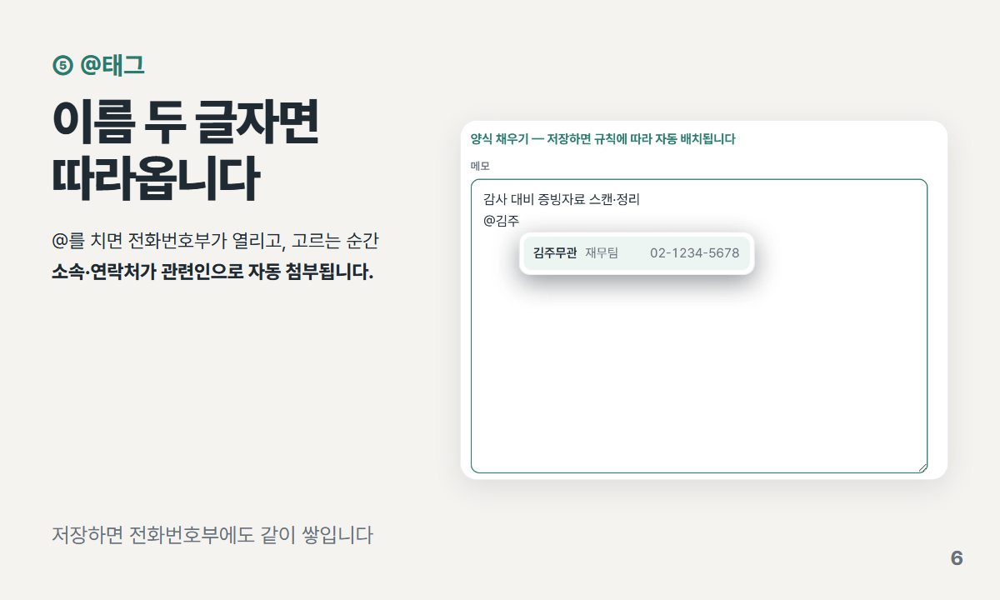
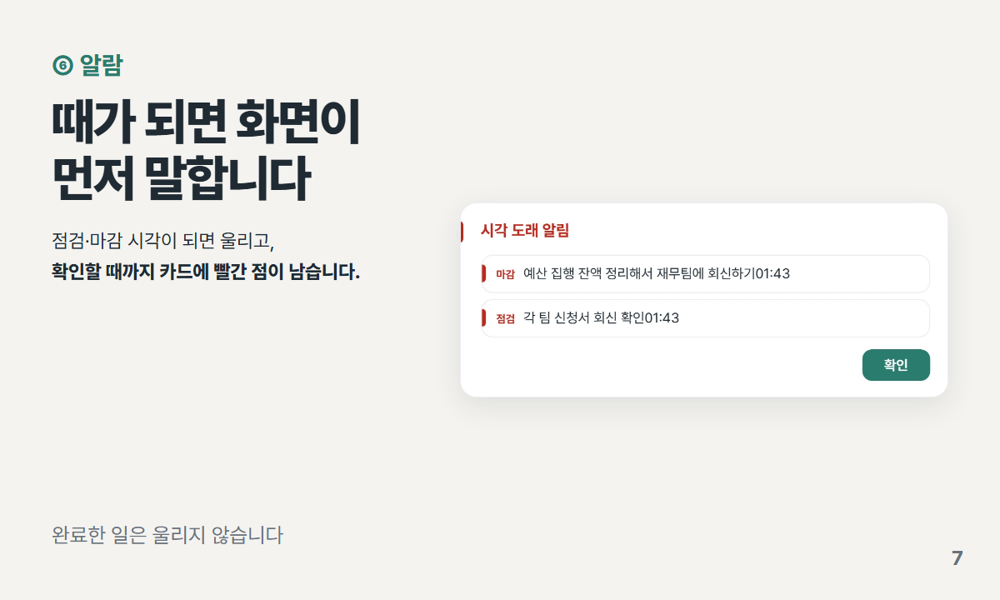
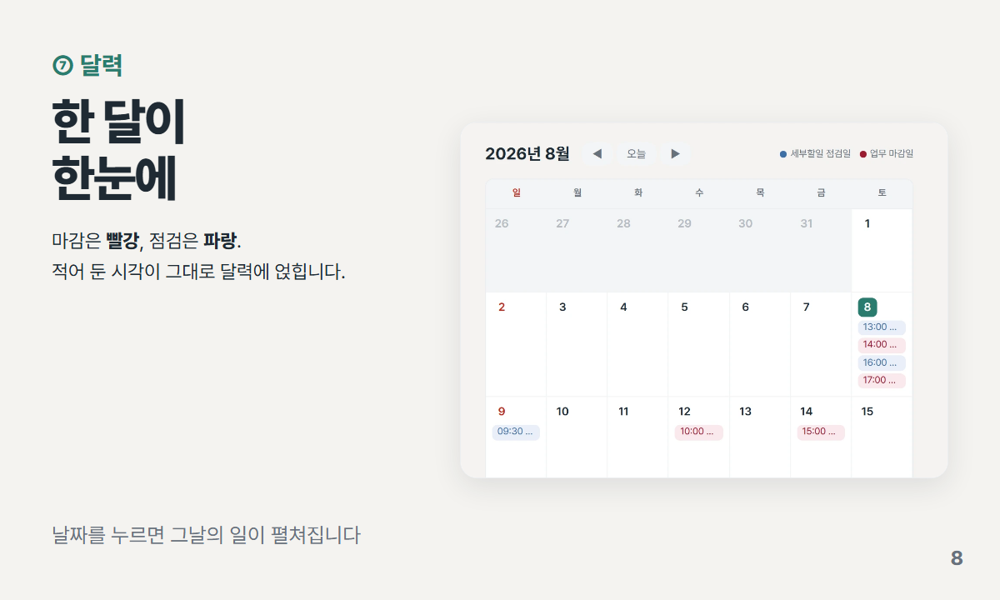
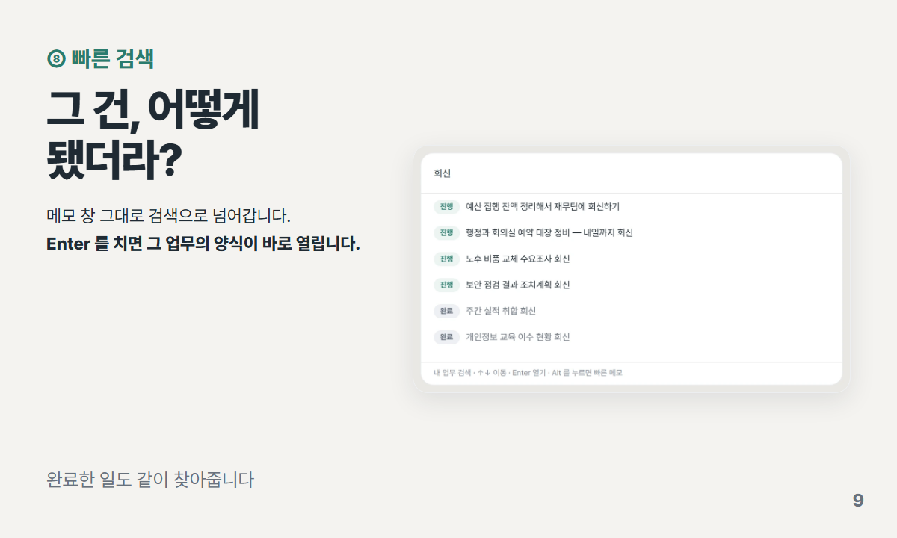
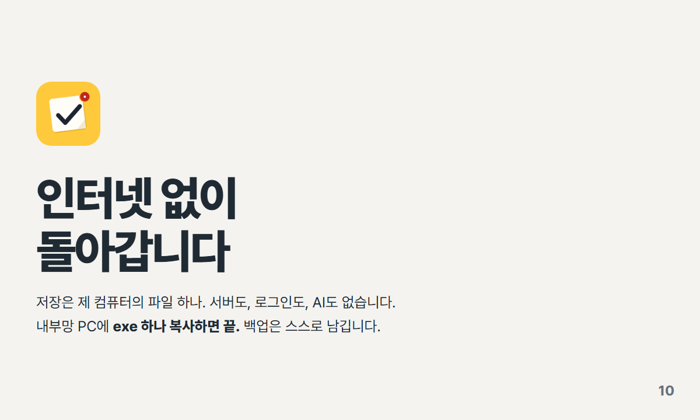

&nbsp;

&nbsp;

## 이런 적, 있으시죠

- **전화를 받는 중에** "아 이거 해야 하는데" 싶은 일이 생기는데, 메모할 곳을 찾는 사이 통화가 끝난다
- **적어는 뒀는데** 포스트잇·메모장·수첩에 흩어져 있어서, 오늘 뭘 해야 하는지는 결국 다시 훑어야 안다
- **할 일 앱을 써 보자니** 계정을 만들라 하고, 적은 내용이 클라우드로 나가고, 애초에 **인터넷이 안 되는 PC**라 설치조차 못 한다

공무원 내부망(인터넷 차단·관리자 권한 없는 PC)에서 쓰려고 만든 **혼자 쓰는 업무 보드**입니다.
**exe 파일 하나**로 돌아갑니다.

* * *

## 어떻게 쓰는 건지, 그림으로

> **이 앱이 다른 할 일 앱과 가장 다른 점입니다 — 카드를 끌어다 옮기는 기능이 아예 없습니다.**
> 시각만 적어 두면 프로그램이 칸을 정합니다. 같은 칸에서는 **먼저 다가오는 일이 맨 위**라, 위에서부터 하시면 됩니다.

* * *

## 보드의 네 칸

카드는 **손으로 옮기지 않습니다.** 적어 둔 시각과 지금 시각을 견줘 매번 다시 계산합니다.

| 칸 | 여기에 오는 일 |
|---|---|
| **분류 대기** | 마감일도 점검일도 아직 **하나도 정하지 않은** 일 |
| **오늘 처리** | 오늘이 마감이거나, 오늘 점검할 게 있거나, 이미 지난 일 |
| **진행 중** | 세부 할 일을 **하나라도 완료한** 일 (이미 손을 댄 일) |
| **예정 · 대기** | 시각은 정했지만 내일 이후라 아직 여유가 있는 일 |

내가 하는 일과 남에게 맡긴 일을 나눠 보고 싶으면 [설정]에서 **담당자 모드**(5칸)로 바꿉니다.

* * *

## 시작하기

1. [`최종 프로그램 산출물/`](./최종%20프로그램%20산출물) 에서 `뭐하려 했더라v3.6.3.exe` 를 받습니다.
2. 아무 폴더(바탕화면·D드라이브 등)에 두고 더블클릭합니다. **설치도, 관리자 권한도 필요 없습니다.**
3. 첫 실행 때 데이터를 보관할 폴더를 물어봅니다. 고른 폴더 안에 `뭐하려했더라_데이터` 가 생기고
   **데이터와 자동 백업이 전부 거기에만** 저장됩니다. 건너뛰어도 되고, 나중에 [설정]에서 옮길 수 있습니다.

**내 데이터는**

- 저장은 **내 PC의 SQLite 파일 하나**입니다. 바깥으로 나가는 통신이 없습니다.
- 고치는 즉시 저장됩니다 — 저장 버튼도, 동기화도 없습니다.
- **자동 백업**이 쌓입니다(최근 것 + 날짜별 첫 백업 2주치). 파일이 깨지면 **성한 백업을 찾아 스스로 복구**하고, 덮기 전에 원본도 따로 남깁니다.
- PC를 옮길 땐 [설정] → **[JSON파일 백업]** 으로 내보내고 새 PC에서 불러오면 됩니다. 데이터 폴더째 복사해도 됩니다.

* * *

## 개발

프론트는 빌드 도구 없는 브라우저 네이티브 ES 모듈(`src/`), 백엔드는 Tauri + Rust + SQLite(`src-tauri/`)입니다.

| 작업 | 명령 |
|---|---|
| 개발 실행 (핫리로드) | `npm run tauri dev` |
| 프론트 테스트 (node:test + jsdom, 278개) | `npm test` |
| 백엔드 테스트 (DB 라운드트립, 39개) | `cd src-tauri && cargo test --lib` |
| 미니 창 레이아웃 검사 (실렌더 31상태) | `node tools/capture-check.mjs` |
| @자동완성·관련 업무 팝업 실조작 검사 (21항목) | `node tools/interact-check.mjs` |
| 저장 성능 회귀 검사 | `node tools/save-perf-check.mjs` |
| 화면 가로 넘침 검사 (실제 Edge) | `node tools/win-render.mjs` |
| 릴리즈 빌드 | `npm run tauri build` |

위 README 카드는 `카드뉴스-도구` 로 굽습니다 — 원본 갈무리는 `tools/cardnews-shots.mjs`(앱 실행 없이
예시 데이터로 촬영), 카드 조판은 `카드뉴스-도구/뭐하려했더라-readme.mjs` 설정을 씁니다.

* * *

## 문서

| 문서 | 무엇 |
|---|---|
| [`사용 설명서.md`](./사용%20설명서.md) | **처음 쓰는 분용** — 상황별("이럴 땐 이렇게") 사용법·화면 그림·FAQ |
| [`CHANGELOG.md`](./CHANGELOG.md) | 버전별 변경 이력 |
| [`디자인 정책.md`](./디자인%20정책.md) | 색·글자·곡률·버튼 역할 규칙 |
| [`구조 분석 보고서.md`](./구조%20분석%20보고서.md) | 코드베이스 구조·안정성 분석 |
| [`시장 리서치 보고서.md`](./시장%20리서치%20보고서.md) | 유사 서비스 조사 — 포지셔닝·기능 로드맵 |
| [`기능 제안서.md`](./기능%20제안서.md) | 공공기관 내부망 관점의 기능 추가 vs 단순 유지 검토 |
| `CLAUDE.md` | 개발 규칙·아키텍처 가이드 (AI 협업용) |

* * *

## 라이선스

[GNU AGPL v3](./LICENSE). 소스를 재배포하거나 네트워크 서비스로 제공하려면 소스를 같은 라이선스로
공개해야 합니다. 개인·기관 내부에서 쓰는 것은 그런 의무가 없습니다.

화면 갈무리는 모두 <b>예시 데이터</b>입니다 — 실제 업무 내용이 아닙니다.

