# 뭐하려 했더라 — 사용 설명서

> 전화를 받다가, 회의를 하다가 "아 이거 해야 하는데" 싶은 일 —
> **일단 던져만 두면 잊지 않게 챙겨 주는** 개인 업무 보드입니다.
> 인터넷도, 설치도, 계정도 필요 없어요.

**이 앱을 한마디로 —** 할 일을 칸에 일일이 정리하는 게 아니라, **시각(마감·점검 때)만 적어 두면
프로그램이 "오늘 할 일"을 알아서 골라 위로 올려 줍니다.** 그래서 손이 훨씬 덜 갑니다.

---

## 목차

1. [30초 요약](#1-30초-요약)
2. [처음 실행하기](#2-처음-실행하기)
3. [딱 하나만 기억하세요 — 카드는 손으로 옮기지 않습니다](#3-딱-하나만-기억하세요--카드는-손으로-옮기지-않습니다)
4. [이럴 땐 이렇게 — 상황별 찾아보기](#4-이럴-땐-이렇게--상황별-찾아보기)
5. [일 던져두기 (입력하는 3가지 방법)](#5-일-던져두기-입력하는-3가지-방법)
6. [사람으로 찾기 — 전화번호부와 @태그](#6-사람으로-찾기--전화번호부와-태그)
7. [보드 자세히 보기](#7-보드-자세히-보기)
8. [알람 — 때가 되면 알려줍니다](#8-알람--때가-되면-알려줍니다)
9. [끝난 일 · 검색 · 달력](#9-끝난-일--검색--달력)
10. [창을 닫아도 꺼지지 않습니다](#10-창을-닫아도-꺼지지-않습니다)
11. [내 데이터는 안전한가요?](#11-내-데이터는-안전한가요)
12. [자주 묻는 질문](#12-자주-묻는-질문)

---

## 1. 30초 요약

익숙해지는 데 딱 네 단계면 됩니다.

1. **던진다** — 떠오른 일을 적고 `Ctrl+Enter`. 다른 프로그램을 쓰는 중이면 `Ctrl+Alt+Space`.
2. **정리한다** — 짬이 날 때 '분류 대기'에 쌓인 카드를 눌러 마감 시각·세부 할 일을 채웁니다.
3. **맡긴다** — 카드는 손으로 옮기지 않습니다. 시각을 보고 프로그램이 알맞은 칸에 놓아 줍니다.
4. **챙김을 받는다** — 시각이 되면 알림창이 앞으로 튀어나옵니다. 끝낸 일은 체크 → [완료]로.

가장 자주 쓰는 키:

| 키 | 하는 일 |
|---|---|
| `Ctrl+S` | **저장** — 양식/주기 업무/프리셋 저장, 메모칸에 쓰는 중이면 그 메모 등록 (아무것도 없으면 백업 내보내기) |
| `Ctrl+Enter` | 메모 등록(메인 입력창·빠른 메모창) · 양식이 열려 있으면 **저장** |
| `Ctrl+Alt+Space` | 어디서든 미니 창 열기 — 먼저 뜨는 화면은 **설정에서 선택**(기본: 내 업무 검색) |
| `Alt` | (미니 창에서) 내 업무 검색 ↔ 빠른 메모 전환 |
| `↑` `↓` `Enter` | (미니 창 검색에서) 결과 이동 · 선택한 업무 열기 |
| `Esc` | 창 닫기 — 쓰던 내용은 지워지지 않음 |

---

## 2. 처음 실행하기

1. `뭐하려 했더라.exe` 파일을 아무 곳(바탕화면, D드라이브 등)에 복사합니다.
2. 더블클릭하면 끝입니다. **설치도, 관리자 권한도 필요 없어요.**
3. 첫 실행 때 "데이터를 어디에 보관할까요?" 하고 폴더를 물어봅니다.
   - 폴더를 고르면 그 안에 `뭐하려했더라_데이터` 폴더가 생기고, 데이터와 자동 백업이 **전부 거기에만** 저장됩니다.
   - 그냥 건너뛰어도 됩니다 — 나중에 [설정] → **[저장 위치 확인·변경]** 에서 언제든 옮길 수 있어요.

> 이미 켜져 있는데 또 실행하면, 새 창이 뜨는 대신 기존 창이 앞으로 나옵니다.

---

## 3. 딱 하나만 기억하세요 — 카드는 손으로 옮기지 않습니다

이 앱이 다른 할 일 앱과 가장 다른 점입니다. **카드를 이 칸 저 칸으로 끌어다 놓지 않아요.**

대신 카드에 **마감 시각**이나 **세부 할 일의 점검 시각**만 적어 두면,
프로그램이 그 시각을 보고 "오늘 할 일인지, 나중 일인지"를 판단해 알맞은 칸에 넣습니다.
같은 칸 안에서는 **시각이 가장 먼저 다가오는 일이 맨 위**로 올라오니, **위에서부터 처리**하면 됩니다.

그래서 사용하는 요령은 간단합니다 — **자리를 고민하지 말고, 시각만 정확히 넣으세요.**
"오늘 뭘 먼저 해야 하지?"는 프로그램이 정리해 줍니다.

> 특정 카드를 다른 칸으로 옮기고 싶다면, 카드를 눌러 **마감·점검 시각을 바꾸면** 자연스럽게 자리가 바뀝니다.
> (카드를 다른 카드 위로 끄는 것은 '자리 옮기기'가 아니라 **두 건을 하나로 합치기**입니다 → [7장](#같은-일이-두-장으로-나뉘었다면--카드-합치기))

---

## 4. 이럴 땐 이렇게 — 상황별 찾아보기

실제로 자주 마주치는 상황부터 찾아가세요.

| 이런 상황 | 이렇게 |
|---|---|
| **전화를 받는 중이다.** 끊기 전에 남겨야 한다 | 화면 위 입력창에 적고 `Ctrl+Enter` → [5-①](#-바로-입력--가장-빠름) |
| **다른 프로그램(결재·한글)을 보는 중이다** | `Ctrl+Alt+Space` → `Alt` → 적고 `Ctrl+Enter` → [5-②](#-미니-창검색빠른-메모--다른-프로그램을-쓰는-중일-때) |
| **제대로 정리해서 넣고 싶다** (관련인·마감·세부 단계) | [양식 입력] → [5-③](#-양식-입력--제대로-정리할-때) |
| **"그 사람 관련 일이 뭐였지?"** | 전화번호부 탭에서 그 사람 행을 클릭 → [6장](#6-사람으로-찾기--전화번호부와-태그) |
| **메모에 사람 이름을 걸어 두고 싶다** | 메모에 `@` 를 치고 이름 두 글자 → [6장 @태그](#메모에-사람-걸어두기--태그) |
| **여러 명 연락처를 한 번에 넣고 싶다** | [엑셀 양식] 받아 채운 뒤 [엑셀 불러오기] → [6장](#여러-명을-한-번에--엑셀-양식-·-엑셀-불러오기) |
| **같은 일을 두 번 적어 카드가 두 장이 됐다** | 한 카드를 다른 카드 위로 끌어 놓기 → [7장](#같은-일이-두-장으로-나뉘었다면--카드-합치기) |
| **오늘 뭘 먼저 하지?** | 보드 '오늘 처리' 칸의 **맨 위부터** → [7장](#카드-읽는-법) |
| **내가 아니라 남이 하는 일까지 구분하고 싶다** | 보드 모드를 '시간·담당자'로 → [7장](#두-가지-보기-방식) |
| **매주·매월 반복되는 일이다** | [설정] → 주기 업무 → [5장](#반복되는-일은-한-번만--주기-업무) |
| **글자가 작다 / 화면이 좁다** | `Ctrl` + 휠, 타이틀바 □ → [7장](#화면-크기는-두-가지--전체화면과-컴팩트560px) |
| **PC를 바꾼다 / 백업하고 싶다** | [설정] → [JSON파일 백업] → [11장](#11-내-데이터는-안전한가요) |

---

## 5. 일 던져두기 (입력하는 3가지 방법)

상황에 따라 골라 쓰세요. **급할수록 위쪽 방법**이 빠릅니다.

### ① 바로 입력 — 가장 빠름
화면 위 입력창에 적고 `Ctrl+Enter` (또는 [바로 입력] 버튼)를 누르면 '분류 대기'에 쌓입니다.
전화를 받는 중이라면 일단 이걸로 던져두세요. 내용이 길어지면 입력창이 **자동으로 늘어납니다**(등록하면 원래 높이로 돌아옴).

메모에 `@이름` 을 적으면 그 사람이 **관련인으로 자동 등록**됩니다 → [6장](#메모에-사람-걸어두기--태그)

### ② 미니 창(검색·빠른 메모) — 다른 프로그램을 쓰는 중일 때
문서·결재 화면을 보다가도 `Ctrl+Alt+Space` 를 누르면 작은 창이 뜹니다. **먼저 뜨는 건 내 업무 검색**이고, 여기서 `Alt` 를 누르면 **빠른 메모**로 바뀝니다. 메모를 적고 `Ctrl+Enter` — 끝. '분류 대기'로 들어갑니다.

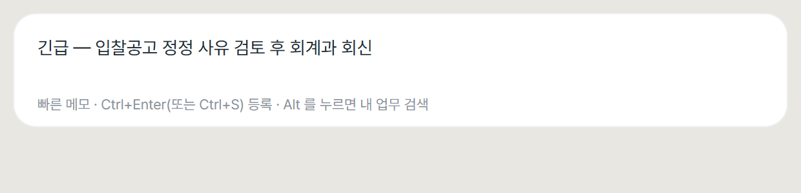

검색 화면에서는 내 업무를 바로 찾을 수 있습니다. `↑`·`↓` 로 고르고 `Enter` 로 열면 메인 창에서 그 업무가 열립니다(아무것도 고르지 않은 채 `Enter` 를 누르면 **첫 결과**가 열려요).

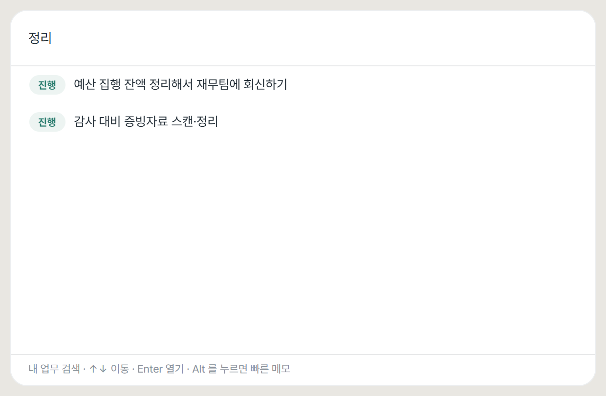

안심하고 써도 되는 이유:
- `Esc` 를 누르거나 다른 창으로 넘어가 닫혀도 **쓰던 내용은 남습니다.** 지워지는 건 직접 지울 때뿐이에요.
- 쓰다 만 채로 컴퓨터가 꺼져도, **다음 실행 때 '분류 대기'에 자동으로 등록**됩니다.
- 창을 다시 열면 검색어는 비워지지만, **쓰던 메모는 그대로** 남아 있습니다.
- 입력칸은 처음에 완전히 비어 있습니다 — 안내 문구는 창 맨 아래 회색 줄에 있으니, 칸 안에 글자가 있는 것처럼 보이는 일은 없습니다.

### ③ 양식 입력 — 제대로 정리할 때
[양식 입력] 버튼을 누르거나 카드를 클릭하면 자세한 양식이 열립니다.

| 항목 | 적는 것 |
|---|---|
| **메모** | 무슨 일인지 (`@이름` 으로 사람 걸기 가능) |
| **관련소속 · 관련인 · 연락처** | 누가 요청했는지 (여러 명 가능) |
| **접수 · 마감시각** | 받은 때와 최종 기한 |
| **식별정보** | 입찰공고번호, SR번호 같은 번호들 |
| **세부 할 일** | 중간 단계들 — 단계마다 점검 시각·**담당자**(비우면 본인) 지정 가능 |
| **파일·폴더 링크** | 관련 문서(한글·엑셀 등)나 폴더 연결 |

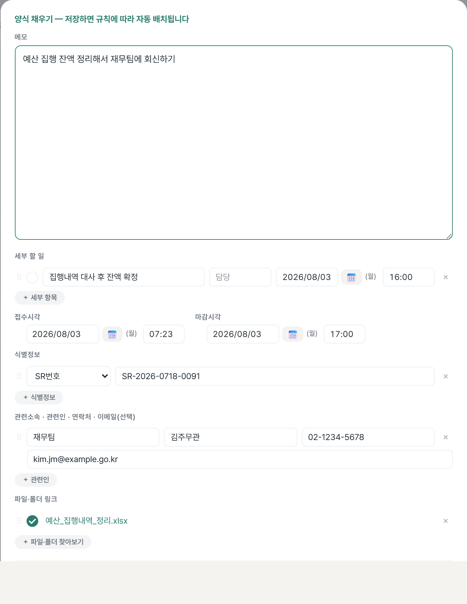

- **파일·폴더 링크**는 행마다 켜고 끌 수 있어요. **켜면** 이름이 링크가 되어 클릭 즉시 열리고(수정 잠금), **끄면** 경로를 직접 고치거나 [찾기]로 다시 고를 수 있습니다. 폴더를 고르면 탐색기로 열립니다.

  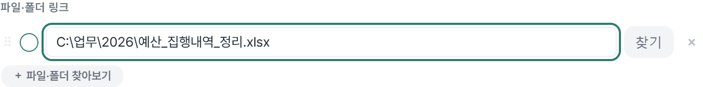

- 세부 할 일·관련인·프리셋·식별정보는 왼쪽 ⠿ 손잡이를 잡고 **드래그로 순서를 바꿀** 수 있습니다.

- **쓰다 만 내용은 사라지지 않습니다.** 양식에 뭔가 적으면 잠시 뒤 자동으로 **임시저장**되고, 저장 버튼 왼쪽에 `임시저장됨 09:24` 처럼 표시됩니다. `Esc` 로 닫거나 앱을 꺼도 그대로 남아, 그 양식을 다시 열면 쓰던 자리에서 이어서 쓸 수 있어요.
  - 임시저장은 **보드 카드에는 반영되지 않습니다.** 카드에 반영되는 건 **[저장 (Ctrl+S)]** 를 눌렀을 때뿐이에요. 즉 '아직 확정 아님' 상태로 편하게 적어두면 됩니다.
  - **[되돌리기]** 를 누르면 **마지막으로 저장한 내용**으로 돌아갑니다(임시저장분은 버려집니다). 새로 만드는 항목이면 작성 중인 내용을 비웁니다. 실수 방지를 위해 한 번 확인을 묻습니다.
  - 저장은 **`Ctrl+S`** 또는 **`Ctrl+Enter`** 둘 다 됩니다.

### 화면 색·미니 창 동작 고르기 — [설정]

헤더의 **[설정]** 을 누르면 팝업이 열립니다. 위쪽에서 고르는 것들:

| 항목 | 고르는 것 |
|---|---|
| **화면 색** | 밝게(기본) / 어둡게 — **미니 창까지 함께** 바뀝니다 |
| **먼저 뜨는 화면** (Ctrl+Alt+Space) | 내 업무 검색(기본) / 빠른 메모 / 양식 메모 |
| **Alt 를 누르면** | 위에서 안 고른 나머지 둘 중 하나 (기본: 빠른 메모) |

- **화면 색은 앱 전체에 하나**입니다. 검색·빠른 메모·양식 메모 세 화면이 항상 같은 색이 되도록,
  미니 창도 메인 화면과 같은 테마를 따릅니다.
- 고르면 **즉시 적용**되고 그대로 저장됩니다. 팝업은 열려 있으니 이어서 다른 것도 고를 수 있어요.
- 단축키로 오가는 화면 **두 개를 직접 고릅니다**(세 화면 중 둘 — 6가지 조합). 아래에 `Ctrl+Alt+Space → … · Alt → …` 로 지금 배치가 표시됩니다:
  - **내 업무 검색**(기본) — 미니 창에서 내 업무를 찾습니다.
  - **빠른 메모** — 미니 창에 그냥 적고 `Ctrl+Enter`(또는 `Ctrl+S`).
  - **양식 메모** — 구조화해서 적고 싶을 때. 미니 창 대신 **메인 창이 앞으로 나오며 빈 양식**이 열립니다. [저장]을 눌러야 카드가 만들어지고, 그 전까지 쓴 내용은 임시저장으로 남습니다.
- 아래쪽에는 보드 모드 선택 · 프리셋·식별정보 관리 · 주기 업무 · 저장 위치/백업/불러오기/XLSX 가 있습니다.
- `Esc` 또는 팝업 바깥을 클릭하면 닫힙니다.

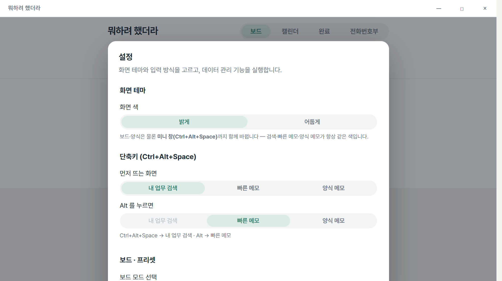

### 반복되는 일은 한 번만 — 주기 업무
매주 보고, 매월 점검처럼 되풀이되는 일은 **[설정] → 주기 업무 입력·관리**에서 한 번만 등록해 두세요.

1. 공통 내용(제목·메모)과 반복 주기를 정합니다 — `매주 요일`(월·수 등) 또는 `매월 며칠`(그 달에 없는 날짜는 말일로 보정) + 시각.
2. **보드 생성 시점**을 고릅니다 — 카드가 언제 보드에 나타날지예요: `주초(월요일) 한 주치 일괄`(기본값) · `하루 전` · `당일` 중에서.
3. 정한 시점이 되면 할 일이 **보드에 자동으로 생깁니다.** 생긴 일은 보통 일과 똑같이 다루면 되고, 카드에는 `주기` 배지가 붙습니다.
4. 등록해 둔 주기는 같은 화면에서 수정·일시정지·삭제할 수 있고, 다음 예정일도 볼 수 있어요.

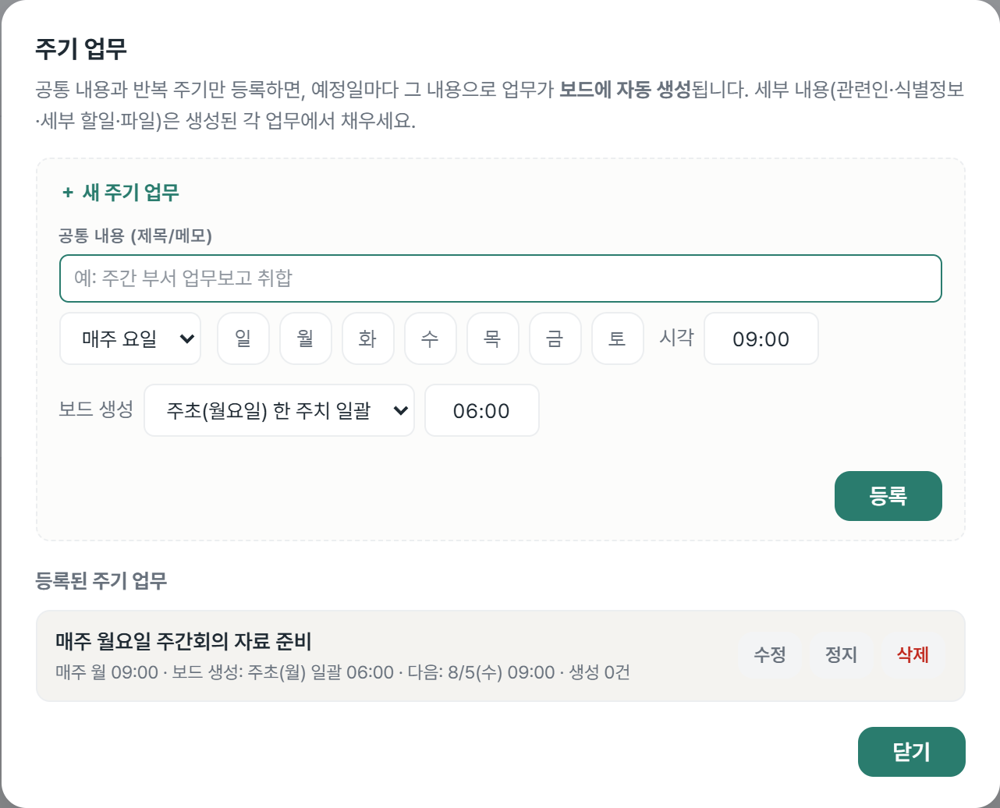

> 주기 자체는 보드에 카드로 보이지 않습니다. 실제 할 일만 그때그때 생겨나고, 주기를 지워도 이미 생긴 일은 남습니다.

### 자주 하는 일은 틀로 저장 — 프리셋
"○○ 검토 요청"처럼 형태가 반복되는 일은 프리셋으로 저장하세요. 버튼 한 번에 세부 할 일까지 채워진 양식이 열립니다.
관리는 **[설정] → 프리셋·식별정보 관리**에서.

---

## 6. 사람으로 찾기 — 전화번호부와 @태그

업무는 결국 **사람**을 따라 옵니다. "그 사람이 뭐 요청했더라?"를 바로 볼 수 있게, 네 번째 탭이 **전화번호부**입니다.

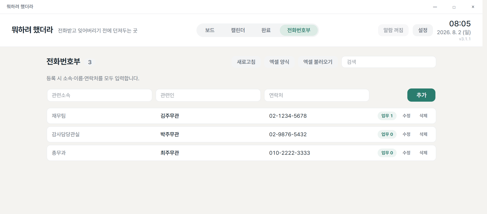

### 등록하는 법
위쪽 입력줄에 **관련소속 · 관련인 · 연락처**를 적고 [추가]. **세 칸을 모두 채워야 등록됩니다.**

> 왜 세 칸을 다 받나요? — 이름만으로는 동명이인이 섞이기 때문입니다. 세 칸이 다 있어야 "이 사람의 일"을 정확히 묶을 수 있어요.
> 일부만 아는 사람은 전화번호부에 넣지 말고 메모에 그냥 적어두세요.

- 목록은 **엮인 업무가 많은 사람 → 소속 → 이름** 순으로 정렬됩니다. 행마다 `업무 N` 배지가 붙어요.
- **[새로고침]** — 이미 만든 업무들의 관련인 중 전화번호부에 없는 사람(세 칸이 다 있는 사람만)을 찾아 한 번에 넣습니다.
- 양식에서 관련인을 적어 저장하면 **자동으로 전화번호부에도 반영**됩니다(중복은 건너뜁니다).

### 여러 명을 한 번에 — [엑셀 양식] · [엑셀 불러오기]
1. **[엑셀 양식]** 을 누르면 제목 줄(**관련소속 · 관련인 · 연락처**)만 있는 빈 엑셀 파일이 저장됩니다.
2. 그 아래에 사람들을 채웁니다(제목 줄은 그대로 두세요).
3. **[엑셀 불러오기]** 로 그 파일을 고르면, 새로 추가될 사람을 먼저 보여주고 [모두 추가]로 확정합니다.
   - 이미 있는 사람과 세 칸이 덜 찬 줄은 자동으로 빠집니다.
   - 이미 쓰던 다른 명부 파일도 됩니다 — 제목 줄에 '소속/기관/부서', '이름/성명/관련인', '전화/연락처' 같은 말이 있으면 알아서 찾습니다.

### 메모에 사람 걸어두기 — @태그
바로 입력·양식 메모·빠른 메모 어디서든 **`@` 를 치고 이름을 두 글자**(또는 번호 세 자리) 이상 입력하면 전화번호부에서 후보를 찾아 줍니다. 골라 넣으면 메모에는 `@김주무관` 만 깔끔하게 들어가고,

- **등록·저장할 때 그 사람의 세 칸이 관련인으로 자동 첨부**됩니다. 따로 관련인 칸을 채울 필요가 없어요.
- 전화번호부에 **실제로 있는 사람**의 태그만 색이 들어옵니다. `@홍길동` 에서 한 글자만 지워 `@홍길` 이 되면 색이 사라져요 — 색이 곧 "제대로 걸렸다"는 표시입니다.
- 태그를 **클릭하면** 그 사람과 엮인 업무가 팝업으로 뜹니다(미니 창에서는 검색 화면으로 넘어갑니다).

### 그 사람 관련 업무 보기
전화번호부의 **행을 클릭**하거나 메모의 **@태그를 클릭**하면 관련 업무 팝업이 열립니다. 목록에서 업무를 누르면 그대로 양식이 열려요.

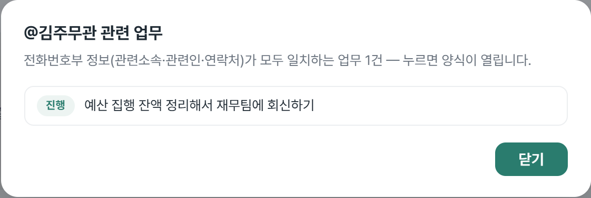

> **무엇이 '엮인 업무'인가요?** — 업무의 관련인 중 **전화번호부 정보(관련소속 · 관련인 · 연락처)가 모두 같은** 사람이 있는 업무입니다. 연락처는 하이픈·공백을 무시하고 숫자만 비교합니다.
> 이름만 같은 사람, 메모에 이름이 적혀만 있는 업무는 엮이지 않습니다 — 동명이인이 섞이지 않게 한 것입니다.
> (그냥 이름·번호로 폭넓게 찾고 싶을 때는 보드 위 **검색창**을 쓰세요 → [9장](#9-끝난-일--검색--달력))

---

## 7. 보드 자세히 보기

메인 화면이 곧 보드입니다. 카드가 시각에 따라 칸에 정리돼 있어요.

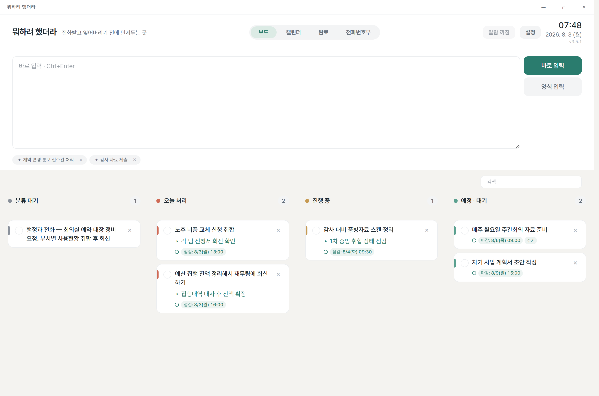

> 예시 데이터로 채운 화면입니다.

### 카드 읽는 법
카드 한 장은 **최대 네 줄**입니다 — 메모 첫 줄만 (길면 두 줄까지), 나머지는 각 한 줄(길면 …로 줄임).

| 줄 | 내용 |
|---|---|
| 1~2줄 | **메모** — 무슨 일인지 (본문 첫 줄, 최대 두 줄) |
| 3줄 | **세부 할 일** — 다음에 할 중간 단계 (있을 때만) |
| 4줄 | **시각** — `점검:`(다가오는 세부 할 일 시각) 또는 `마감:`(마감 시각) |

- 시각 태그는 **임박(지났거나 2시간 이내)일 때만 붉게** 강조됩니다. 그 밖엔 중립색이에요.
- `주기` 배지는 주기 업무에서 자동으로 생긴 카드라는 뜻입니다.
- 시각 앞의 작은 점(●)은 알람 상태예요 → [8. 알람](#8-알람--때가-되면-알려줍니다) 참고.
- 메모의 나머지 줄, 관련인·담당자·식별정보·파일 같은 자세한 내용은 **카드를 클릭**해 양식에서 봅니다.

### 같은 일이 두 장으로 나뉘었다면 — 카드 합치기
급해서 두 번 던져 넣었거나, 나중에 알고 보니 같은 건이었을 때 — **카드를 끌어서 다른 카드 위에 놓으면 하나로 합쳐집니다.**

- **받는(가만히 있던) 카드**가 기준입니다: 그 카드의 알람 상태·담당·완료 여부가 유지돼요.
- 메모는 이어 붙고, **접수·마감은 둘 중 이른 쪽**을 씁니다(마감을 놓치지 않는 방향).
- 세부 할 일은 합쳐서 점검 시각 순으로 정렬되고, 관련인·식별정보·파일은 중복을 뺀 뒤 합쳐집니다.
- 합친 직후 뜨는 알림에서 **[실행 취소]** 로 두 장을 되살릴 수 있습니다.

### 두 가지 보기 방식
보기 방식은 **[설정] → 보드 모드 선택**에서 '시간' 또는 '시간·담당자'로 고릅니다(고른 방식은 저장돼요).

**① 시간 방식 (기본)** — "언제 할 일인가"로 나눕니다.

| 칸 | 여기에 오는 일 |
|---|---|
| **분류 대기** | 마감일도 점검일도 **아직 하나도 정하지 않은** 일 |
| **오늘 처리** | 오늘이 마감이거나, 오늘 점검할 게 있거나, 이미 지난 일 |
| **진행 중** | 세부 할 일을 **하나라도 완료**한 일 (손을 댄 일) |
| **예정 · 대기** | 시각은 정해졌는데 내일 이후라 아직 여유가 있는 일 |

**어느 칸으로 갈지는 아래 순서대로 판단해서, 처음 걸리는 칸으로 갑니다.**

1. 마감일이나 점검일이 **오늘이거나 이미 지났으면** → **오늘 처리**
2. 세부 할 일을 **하나라도 완료했으면** → **진행 중**
3. 마감일도 점검일도 **하나도 없으면** → **분류 대기**
4. 나머지(내일 이후 시각만 있음) → **예정 · 대기**

> **순서가 중요한 이유** — 3번(분류 대기)이 2번(진행 중)보다 **뒤**에 있습니다. 그래서 시각을 안 정했더라도 이미 세부를 체크하기 시작한 일은 분류 대기로 되돌아가지 않고 **진행 중에 남습니다.**
>
> 반대로 **시각을 모두 지우면** (아직 손대지 않은 일이라면) 다시 분류 대기로 돌아옵니다.

**② 시간·담당자 방식** — "내 일인가, 남에게 넘겨 기다리는 일인가"까지 함께 봅니다.

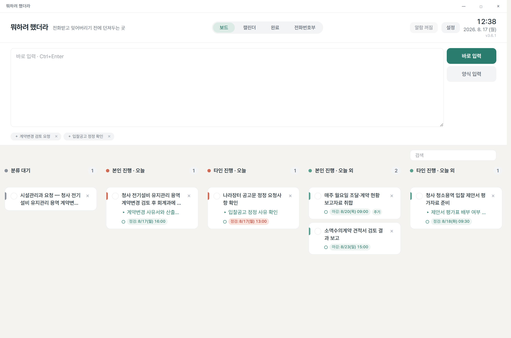

| 칸 | 여기에 오는 일 |
|---|---|
| **분류 대기** | 마감일도 점검일도 없고, 아직 손도 대지 않은 일 |
| **본인 진행 · 오늘** | 담당이 나, 오늘 처리할(또는 지난) 일 |
| **타인 진행 · 오늘** | 남에게 넘겨둔 일 중 오늘 챙겨야 하는 일 |
| **본인 진행 · 오늘 외** | 담당이 나, 오늘 처리할 시각이 없는 일 |
| **타인 진행 · 오늘 외** | 남에게 넘겨둔 일 중 오늘 처리할 시각이 없는 일 |

이쪽은 판단이 두 단계뿐입니다(이 방식에는 '진행 중' 칸이 없어요).

1. 마감일·점검일이 **하나도 없고** 아직 **손도 대지 않았으면** → **분류 대기**
2. 나머지는 **오늘 / 오늘 외**와 **본인 / 타인**을 조합한 네 칸으로

> 세부를 하나라도 완료한 일은 시각이 없어도 분류 대기로 가지 않고 **본인 진행 · 오늘 외**에 놓입니다 — **보기 방식을 바꿔도 일이 칸을 오가지 않게** 맞춰 두었습니다.

- **담당자는 세부 할 일마다** 적습니다(비워 두면 본인).
- 카드의 본인/타인은 *가장 먼저 다가오는 미완료 세부 할 일의 담당자*로 정해집니다.
- 그래서 세부를 **전부 완료하면** 담당자가 본인으로 넘어갑니다(남은 미완료 세부가 없으니까요).

### 화면 크기는 두 가지 — 전체화면과 컴팩트(560px)
창은 **두 크기**만 씁니다. 타이틀바의 **최대화/복원 버튼(□)** 으로 오갑니다.

- **전체화면** — 넓은 4·5칸 데스크톱 보드. 기본값입니다.
- **컴팩트(560px)** — 세로로 좁은 **한 칸** 보기. 화면 한쪽에 띄워두고 곁눈질하며 쓰기 좋아요.
  - 좁은 폭에서는 양식의 날짜 옆 **요일 표시`(수)`가 빠집니다** — 날짜칸에 이미 날짜가 적혀 있어서, 그 자리를 날짜·시각 입력칸에 내주는 편이 낫기 때문입니다. 전체화면에서는 그대로 보여요.

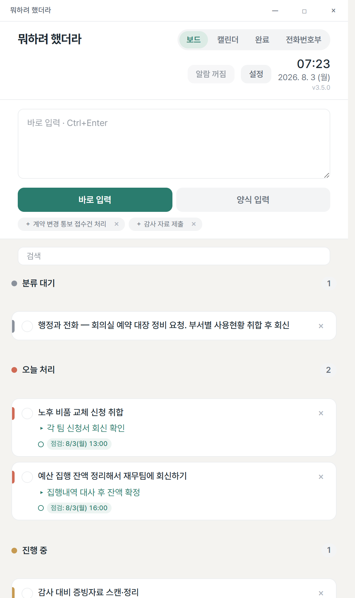

### 글자가 작게 느껴진다면 — Ctrl + 휠
화면 아무 데서나 **`Ctrl`을 누른 채 마우스 휠을 굴리세요.** 위로 굴리면 커지고, 아래로 굴리면 작아집니다(90%~120%, 한 번에 10%씩). 바꾼 크기는 저장돼서 다음에 켤 때도 그대로입니다.

글자만 커지는 게 아니라 **화면 전체가 같은 비율로 커집니다** — 배치가 흐트러지거나 글자가 잘리지 않아요. **빠른 메모·빠른 검색 창도 같은 크기로 따라옵니다.**

---

## 8. 알람 — 때가 되면 알려줍니다

마감·점검 시각이 되면 **알림창이 뜨고 소리가 납니다**(앱이 뒤에 가려져 있어도 앞으로 나옵니다).

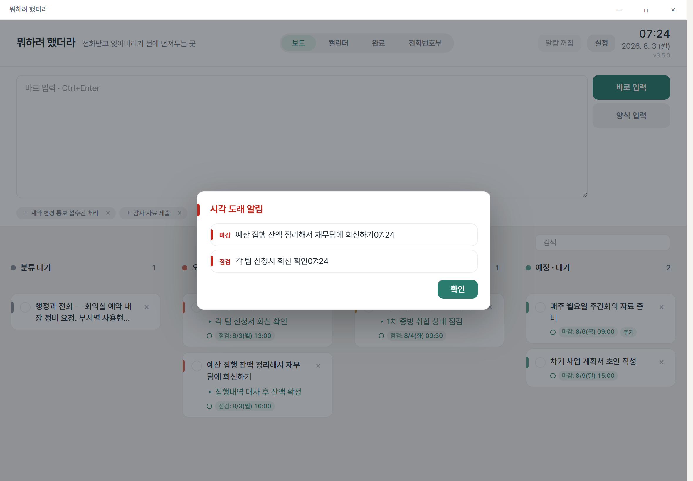

| 버튼 | 하는 일 |
|---|---|
| **[확인]** | 알람 끄기 — 카드에 확인 표시(초록 점)가 남습니다 |

카드의 작은 점(●)이 알람 상태를 나타냅니다: **빈 점**(대기) → **빨강**(울리는 중) → **초록**(확인함).
끝낸 일에는 점이 없어요. 알람 전체는 상단의 알람 버튼으로 켜고 끕니다.

---

## 9. 끝난 일 · 검색 · 달력

**끝난 일** — 카드 왼쪽 동그라미를 체크하면 [완료] 탭으로 넘어갑니다. 완료 카드는 메모와 `완료: 시각`을 보여줘요.
카드를 ×로 지웠다면, 직후에 뜨는 알림에서 **실행 취소**할 수 있습니다.

**검색** — 검색창에 무엇이든 넣어 보세요: 메모 내용, 관련인, 소속, 담당자, 번호, 파일 이름. 연락처는 `01012345678`처럼 숫자만 쳐도 찾아집니다. 여기 검색은 **부분 일치**라 넓게 걸립니다 — 특정 인물의 일만 정확히 보고 싶다면 [전화번호부](#6-사람으로-찾기--전화번호부와-태그)를 쓰세요.

**달력** — 이번 달 일정을 한눈에 봅니다. **진행 중인 일만** 나와요: 그날 마감(빨강)과 그날 점검할 세부 할 일(회청색)만 표시되고, 끝낸 것은 나오지 않습니다. 날짜를 누르면 그날의 일 목록이 아래에 열립니다.

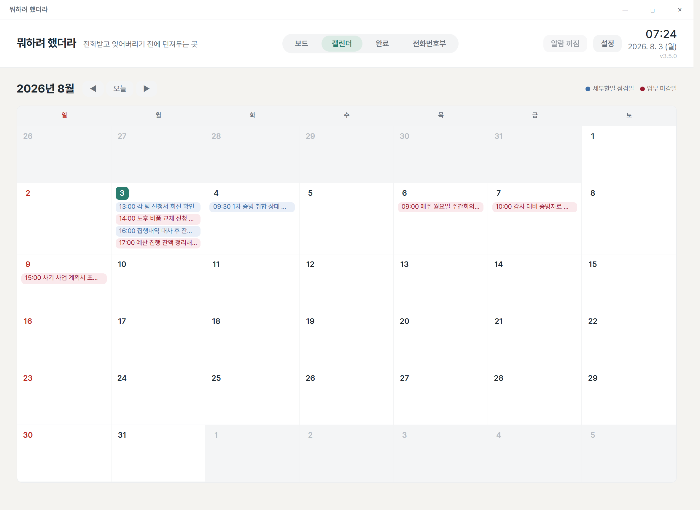

---

## 10. 창을 닫아도 꺼지지 않습니다

창의 ×를 눌러도 프로그램은 **화면 오른쪽 아래 트레이(시계 옆)** 에 남아, 알람과 빠른 메모 단축키를 계속 챙깁니다.

- 트레이 아이콘 **클릭** → 창 다시 열기
- 트레이 아이콘 **우클릭** → 나오는 메뉴에서 [종료] (완전히 끄기)

---

## 11. 내 데이터는 안전한가요?

- **저장은 자동입니다.** 바꾸는 즉시 저장돼요 — 저장 버튼이 아예 없습니다.
- **저장이 막혀도 포기하지 않아요.** 백신이나 클라우드 동기화 폴더가 파일을 잠깐 붙잡는 일은 흔한데, 그럴 땐 화면 맨 위에 경고가 뜨고 **잠시 뒤 자동으로 다시 시도**합니다(1초 → 2초 → 4초 … 30초 간격). 저장이 되면 경고는 저절로 사라져요.
  - 계속 안 되면 데이터를 데이터 폴더 안 `emergency` 폴더에 **파일로 따로 떨궈** 둡니다. 경고창에 그 파일 위치가 적혀요. 그 파일도 [JSON·DB파일 불러오기]로 그대로 되살릴 수 있습니다.
  - 그래도 경고가 계속 떠 있으면 [설정] → [JSON파일 백업]으로 한 번 더 따로 저장해 두시는 게 안전합니다.
- **끌 때도 마저 씁니다.** [종료]를 누르면 남은 저장을 끝내고 닫혀요. 쓰는 도중에 프로그램이 끊기지 않습니다.
- **자동 백업** — 30분마다, 그리고 날마다 첫 백업본을 14일간 보관합니다. 실수로 여러 건을 한꺼번에 지운 채 저장돼도, 그 **직전 상태가 백업으로 따로 남습니다.**
- 시작할 때 데이터 파일이 손상돼 있으면 **가장 최근의 멀쩡한 백업으로 스스로 복구**합니다. 이때 **원래 파일도 지우지 않고 옆에 남겨** 둬요(`wmhh.before-recovery-…`) — 복구가 잘못됐다 싶으면 그 파일을 [불러오기]로 되살리면 됩니다.
- **"저장하지 않았습니다" 창이 뜨면** — 다른 창이나 예전에 켜둔 앱이 그 사이 데이터를 바꿨다는 뜻이에요. 지금 화면 내용으로 덮으면 그쪽 작업이 사라지므로 **일부러 저장을 멈춘 것**입니다. 지금 화면 내용은 파일로 남겨 두고 최신 데이터를 다시 불러옵니다. **문제가 생긴 게 아니라 막아준 것**이니 놀라지 않으셔도 됩니다.
- **무슨 일이 있었는지 기록이 남아요.** 데이터 폴더의 `wmhh.log` 에 실행·종료·복구와 업무 건수가 바뀐 저장이 한 줄씩 쌓입니다. 문제가 생겼을 때 원인을 찾는 용도이고, **업무 내용은 적지 않습니다**(건수와 사건만).
- 모든 데이터는 **내가 고른 폴더 안에만** 있습니다. 인터넷으로 나가는 것은 하나도 없어요.

**다른 컴퓨터로 옮기기** — [설정] 메뉴에서:

| 버튼 | 용도 |
|---|---|
| **[JSON파일 백업]** | 데이터 전체를 파일 하나로 저장 → 새 PC에서 [불러오기]로 복원 |
| **[JSON·DB파일 불러오기]** | JSON 백업 또는 `.sqlite` 백업을 골라 복원 |
| **[XLSX 다운로드]** | 엑셀로 내보내기 — **보고서용**입니다(복원 불가, 이사·백업은 JSON으로) |

---

## 12. 자주 묻는 질문

**Q. 인터넷이 안 되는 PC인데 쓸 수 있나요?**
네. 인터넷을 전혀 쓰지 않습니다. 내부망·폐쇄망에서 그대로 동작해요.

**Q. 설치 권한이 없는데요?**
설치 과정 자체가 없습니다. exe 파일 하나를 복사해 실행하면 끝이에요.

**Q. 실행이 안 돼요.**
구형 Windows 10이라면 "WebView2 런타임"이 없을 수 있습니다(Windows 11·최신 Windows 10은 기본 내장). 전산 담당자에게 WebView2 오프라인 설치를 요청하세요.

**Q. 알람 소리가 안 나요.**
상단 알람 버튼이 꺼져 있지 않은지, Windows 알림 설정에서 이 앱이 차단되지 않았는지 확인해 보세요.

**Q. 새 버전으로 바꿨는데 예전 화면 그대로예요.**
프로그램이 **이미 켜져 있어서** 그렇습니다. 두 개가 동시에 돌면 서로의 저장을 덮어쓰기 때문에, 이미 실행 중이면 새로 뜨지 않고 켜져 있던 창이 앞으로 나옵니다. 트레이(시계 옆) 아이콘을 우클릭해 **[종료]** 한 뒤 새 exe 를 실행하세요.
그리고 **예전 버전 exe 는 지우거나 다른 폴더로 치워 두세요** — 실수로 옛 버전을 켜두면 그쪽이 옛 내용을 저장해 버릴 수 있습니다.

**Q. 껐다가 바로 켜니 "저장이 잠겨 있습니다" 같은 안내가 떠요.**
v3.3.9 에서 고쳤습니다. 종료 직후 몇 초 안에 다시 켜면 이전 프로그램이 아직 파일을 붙잡고 있는데, 그걸 **파일 손상으로 오해**해서 생기던 일이었어요. 최신 버전에서는 잠깐 기다렸다 다시 확인하고, 잠금만으로는 잠그지 않습니다. 그래도 뜬다면 데이터 폴더의 `wmhh.log` 를 함께 알려주세요.

**Q. 컴퓨터를 바꾸게 됐어요.**
[JSON파일 백업]으로 파일 하나를 만들어 가져간 뒤, 새 PC에서 [JSON·DB파일 불러오기]를 하면 됩니다. exe도 같이 복사하면 끝이에요.

**Q. 전화번호부에 이름만 아는 사람을 넣고 싶어요.**
전화번호부는 **세 칸(관련소속·관련인·연락처)이 모두 있어야** 등록됩니다. 일부만 아는 사람은 메모나 양식의 관련인 칸에 자유롭게 적어 두세요 — 검색으로는 그대로 찾아집니다.

**Q. @태그를 달았는데 색이 안 들어와요.**
그 이름이 전화번호부에 없기 때문입니다. 전화번호부에 세 칸을 채워 등록하면 색이 들어오고, 그때부터 클릭으로 관련 업무를 볼 수 있어요.

**Q. 미니 창(@태그 목록)에서 아랫줄이 잘려 보여요.**
v3.4.8 에서 고쳤습니다. Windows **[설정] → [접근성] → [텍스트 크기]** 를 100% 보다 크게 쓰고
계시면, 그만큼 화면이 확대되는데 예전 버전은 그걸 모르고 창을 작게 만들어 목록 아래가
잘렸습니다. 최신 버전은 실제 확대 비율을 직접 재서 창을 만듭니다(그래서 미니 창이 예전보다
가로로도 조금 넓어집니다 — 원래 설계 크기를 되찾은 것입니다).

**Q. @태그 목록에 사람이 몇 명까지 나오나요?**
한 화면에 **최대 10명**이 온전히 보이고, 더 많으면 목록이 스크롤됩니다. `↑`/`↓` 로 고르고
`Enter` 로 넣으세요. 생각보다 적게 나온다면 그 검색어에 걸리는 사람이 실제로 그만큼인지
전화번호부 탭에서 확인해 보세요.

**Q. 창을 특정 크기로 조절하고 싶어요.**
창은 **전체화면**과 **컴팩트(560px)** 두 가지만 지원합니다. 타이틀바의 □ 버튼으로 두 크기를 오가세요.

**Q. 카드를 원하는 칸으로 직접 옮기고 싶어요.**
카드는 시각으로만 자리가 정해집니다. 카드를 눌러 **마감·점검 시각을 바꾸면** 원하는 칸으로 옮겨집니다. (카드를 다른 카드 위로 끄는 것은 **두 건 합치기**입니다.)
